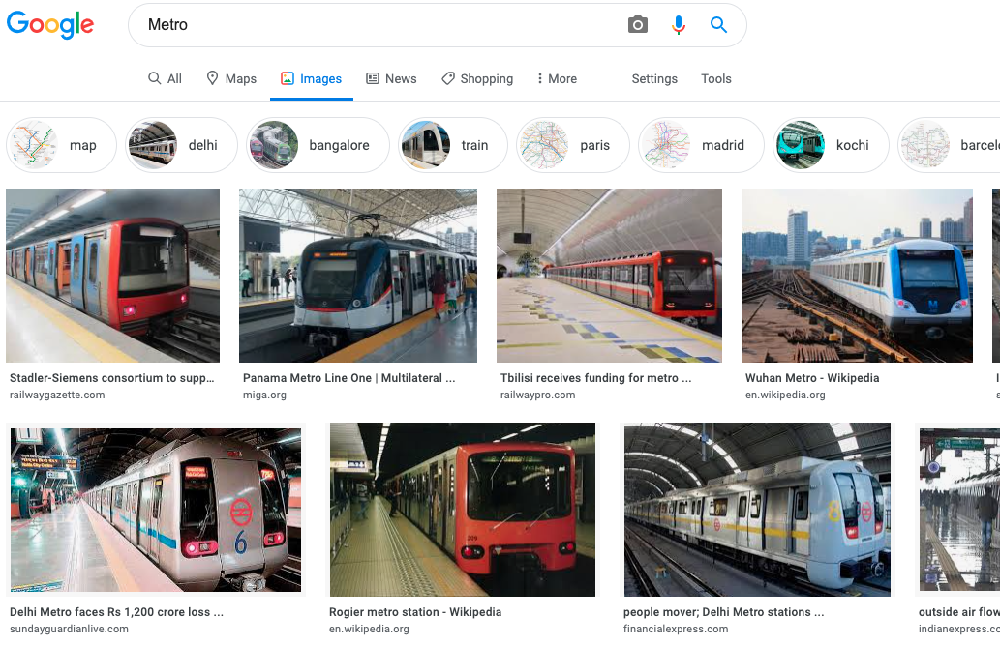

import Logo from './metro.svg'
import Terminal from '../../components/decks/Terminal'
import { Split, FullScreenCode } from '../../components/decks'

# Metro

---

If you search metro on Google

<div style={{padding: '1rem', maxWidth: 590, width: '100%'}}>



</div>

---

<Terminal style={{ fontSize: 10, paddingLeft: 24, paddingRight: 24, paddingTop: 36 }}>

```
┌──────────────────────────────────────────────────────────────────────────────┐
│                                                                              │
│  Running Metro Bundler on port 8081.                                         │
│                                                                              │
│  Keep Metro running while developing on any JS projects. Feel free to        │
│  close this tab and run your own Metro instance if you prefer.               │
│                                                                              │
│  https://github.com/facebook/react-native                                    │
│                                                                              │
└──────────────────────────────────────────────────────────────────────────────┘

Looking for JS files in
   /Users/nuttapat.kirawittaya/Projects/react-native

Loading dependency graph, done.
 BUNDLE  [ios, dev] ./index.dev.js ▓▓▓▓▓▓▓▓▓▓▓▓▓▓▓▓ 100.0% (9334/9334), done.
```

</Terminal>

---


# Metro

Metro is 🚇 The JavaScript bundler for React Native

https://facebook.github.io/metro/

https://github.com/facebook/metro

---

# Main features

- 📦 Best for bundle project into **SINGLE FILE**
- ⚡ provide Fast bundle speed 🙈 , the Sub-second reload cycle (Fast bundle reload)
- 🖼️ Bundle assets for react-native (and image resolution @2x, @3x)
- Haste mode support
- Built-in support platform resolution (.ios .android)
- Built-in iupport minify and sourceMap

---

[http://localhost:8081/index.dev.bundle?platform=ios&dev=true&minify=false](http://localhost:8081/index.bundle?platform=ios&dev=true&minify=false)

---

[http://localhost:8081/App/Product/ProductPage.js?platform=ios&dev=true&minify=false](http://localhost:8081/App/Product/ProductPage.js?platform=ios&dev=true&minify=false)

- `platform` => ios, android (and web, windows ...)
- `dev` => Dev/Production mode
- `minify` => Using terser, minify/uglify your code

---

# Bundling process

1. Resolution
2. Transformation
3. Serialization

---

# Resolution

Build a directed graph of dependecies from the entry point. To find which file is required from another file Metro uses a resolver.

<Terminal>

```
Unable to resolve module `./YellowBoxImageSource`
```

</Terminal>

---

## Haste module system

- New module system created and used by Facebook.
- It's a dependency management system for **static** resources for node.js.
- It used in jest, react-native and support by flow.

---


```js
// ---- App.js -----

const require('warnOnce')

// ---- Utilities/warnOnce.js -----

function warnOnce() {
  if (warnedKeys[key]) {
    return;
  }
  console.warn(message);
  warnedKeys[key] = true;
}

module.exports = warnOnce;
```

These modules can be swapped out depending on your needs.

---


<Terminal>

```
Error: jest-haste-map: Haste module naming collision:
  Duplicate module name: react-native

This error is caused by `hasteImpl` returning
the same name for different files.
```

</Terminal>

---

# Metro Config

open our rn-cli.config.js (metro.config.js in newer version)

- blockList - Remove specific files/folder from dependecies graph
- extraNodeModules - Provider global resolver to package

---

# [Symlink issue](https://github.com/facebook/metro/issues/1)

Opened issue since 28 Feb 2017, and doesn't seem to be fix soon 😞. The most important use case of symlink is Monorepo

---

# Our [metro.config.js](vscode://file/Users/nuttapat.kirawittaya/Projects/shopee_react_native/react-native/rn-cli.config.js)

---

# Transformation

A transformer is responsible for converting (transpiling) a module to a format that is understandable by the target platform.
Using [babel](https://babeljs.io/) for transpiling and minify using [Terser](https://github.com/terser/terser)

---

# Our [babel.config.js](vscode://file/Users/nuttapat.kirawittaya/Projects/shopee_react_native/react-native/babel.config.js)

---

# Metro Config

- inlineRequires
- RAM Bundle
- Secret feature
  - experimentalImportSupport
  - unstable_disableES6Transforms

---

## Asset

```js
/* registerAsset return number */
module.exports = require("@react-native/assets").registerAsset({
  "__packager_asset": true,
  "hash": "9ec9c5721fcd5cc401b4499a0cc8878bc1a18bb5",
  "height": 24,
  "name": "my-asset",
  "scales": [1, 1.5, 2, 3, 4],
  "type": "png",
  "width": 240
});
```

https://github.com/facebook/react-native/blob/master/packages/assets/registry.js

---

# Serialization

A modules after transformer to one or multiple bundles

```js
__d(
  function( /* Factory */
    g /* Global */,
    r /* Require */,
    i /* Import default `import v from 'foo';` */,
    a /* Import all `import * as w from 'bar';` */,
    m /* Module `module.exports` */,
    e /* Export `export default` */,
    d /* Dependencies */) {...},
  "7f599bd321bba313b6dccc330a53c298" /* Module hash */,
  ["92ffabb4efcde019ceb66c12c3f21968"] /* Dependencies */
)
__r('be4ce60014635e63d8563c6840e31df7'); /* Run */
```

---

# Serialization

- Add polyfilled code
- Serialize all module
- Generate sourceMap

---

# Multi bundle

- Splitting single bundle to multiple small bundle
- Multiple level(2) of bundle [base, main]
- Base bundle load first
- Code that in base bundle shouldn't be in main bundle

---

# Metro Config

- createModuleIdFactory - Used to generate the module id for require statements.
- processModuleFilter - Discard specific modules from the output.

---

# Tools

---

## [metro-visualizer](https://www.npmjs.com/package/metro-visualizer)

- Visualize dependencies graph
- Already [removed](https://github.com/facebook/metro/commit/f4e40c686fe330f3f40a4b1c47c78111dddb55c0)

---

## [bundle-visualizer](https://github.com/IjzerenHein/react-native-bundle-visualizer)

- Better version
- using source map emitted by metro and open with [source-map-explorer](https://github.com/danvk/source-map-explorer)

---

## createConnectMiddleware

Instead of creating the full server, creates a Connect middleware that answers to bundle requests.
Allow you to integrate with `express`

